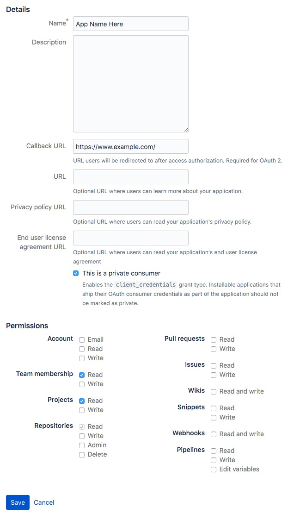

### About

This project contains my quick implementation to get all repositories information in my BitBucket team for further analysis.

### Motivation

We have many repositories under our BitBucket team and wanted to know which of them are active (has activity in the last 30 days).

### Usage

1. Create an app inside BitBucket (Settings > OAuth) with the following settings:

   

2. Copy and paste the app ID and secret into `config.yaml` file

3. Open the BitBucket team profile page, copy the encoded team UUID (everything after `https://bitbucket.org/`, _excluding_ the last forward slash)

4. Run the script - `GO111MODULE=on go run *.go`

5. View the result (`bitbucket.sqlite3`) in [SQLite browser](https://sqlitebrowser.org)

6. [Optional] - run the `group-by-project-order-by-time.sql` file using SQLite browser to better format the result

7. [Optional] - save the formatted result to CSV file name `sorted.csv` for further analysis

### Lessons Learned

- Adding `req.Header.Add("Accept-Encoding", "gzip, deflate")` is evil - it will make the response body turns into binary which at first looks like chunked data - removing it from the Go HTTP client code solves the problem
